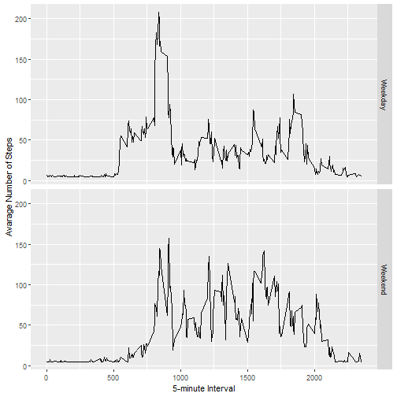

### Title: "Reproducible Research: Peer Assessment 1"

## Loading and preprocessing the data

Load the activity data and take a look at first 6 records and check data attributes.


```r
activity <- read.csv('activity.csv')
head(activity)
```

```
##   steps       date interval
## 1    NA 2012-10-01        0
## 2    NA 2012-10-01        5
## 3    NA 2012-10-01       10
## 4    NA 2012-10-01       15
## 5    NA 2012-10-01       20
## 6    NA 2012-10-01       25
```

```r
str(activity)
```

```
## 'data.frame':	17568 obs. of  3 variables:
##  $ steps   : int  NA NA NA NA NA NA NA NA NA NA ...
##  $ date    : Factor w/ 61 levels "2012-10-01","2012-10-02",..: 1 1 1 1 1 1 1 1 1 1 ...
##  $ interval: int  0 5 10 15 20 25 30 35 40 45 ...
```

## What is mean total number of steps taken per day?


```r
totalsteps <- tapply(activity$steps,as.Date(activity$date),sum,na.rm=T)
hist(totalsteps,breaks=50,main='Total numbers of steps taken per day',xlab='Total Steps',ylab='Number of Days',col='cadetblue3')
```


The mean total number of steps per day is: 9,354.23.

The median total number of steps per day is: 10,395.

## What is the average daily activity pattern?

```r
avgsteps <- aggregate(activity$steps~activity$interval,FUN = mean,na.rm=T)
colnames(avgsteps) <- c('interval','steps')
with(avgsteps,plot(interval,steps,type='l',ylab='Daily Average Steps',xlab='5 Minutes Interval',main='Average Daily Activity Pattern'))
```


```r
max_int <- avgsteps[which.max(avgsteps$steps),'interval']
```

The 5-minutes interval which contains the maximum number of steps, on average across all the days in the datasetis: 835.

## Imputing missing values

There are 2304 missing values in the dataset. We are imputing missing values with the mean. Below histogram shows the total number of steps taken each day after we imputing missing values.


```r
library(Hmisc)
library(ggplot2)
```

```r
activity2 <- activity
activity2$steps <- impute(activity$steps, fun=mean)
totalsteps2 <- tapply(activity2$steps,as.Date(activity2$date),sum)
hist(totalsteps2,breaks=50,main='Total numbers of steps taken per day',xlab='Total Steps',ylab='Number of Days',col='cadetblue3')
```


After imputing missing values with mean, the mean total number of steps per day is: 10,766.19.

After imputing missing values with mean, the median total number of steps per day is: 10,766.19.

The values are higher than what we reported before. 

## Are there differences in activity patterns between weekdays and weekends?


```r
activity2$date <- as.Date(activity2$date)
activity2$wday<- ifelse(weekdays(activity2$date) %in% c('Saturday','Sunday'),'Weekend','Weekday')
avgsteps2 <- aggregate(activity2$steps~activity2$interval + activity2$wday,FUN = mean)
colnames(avgsteps2) <- c('interval','wday','steps')

g <- ggplot(avgsteps2,aes(interval,steps))
g + geom_line() + labs(x="5-minute Interval",y="Avarage Number of Steps") + facet_grid(wday~.)
```



Looking at the plot for activity pattern between weekdays and weekneds, we can see that the activity is lower during weekends.
